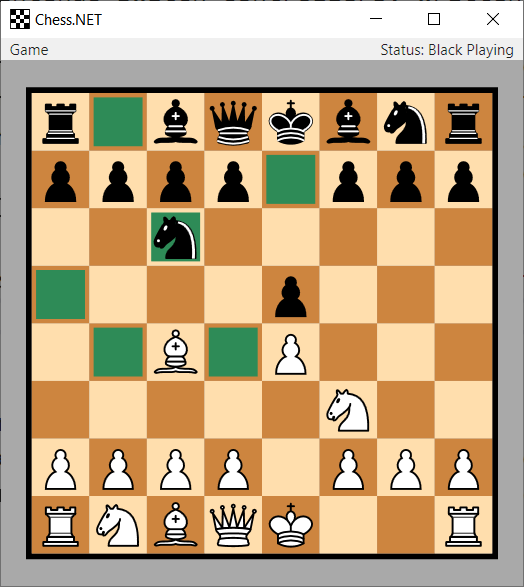

# Chess.NET

`Chess.NET` is a local two-player chess game, written in C#/WPF. It aims to provide a clean architecture and design according to the Model-View-ViewModel (MVVM) architectural pattern. Notable features are:

* Supports all standard rules of a chess game, including castling, en passant and promotion.
* Supports hints for chess piece movements, allowing only valid movements to be selected.
* Supports a wide range of animations using the features of WPF.
* Supports window resizing for arbitrary display resolutions.
* Provides a fully immutable implementation of the chess game model.
* Provides an undo command to restore previous chess game states.
* Provides a full code documentation.